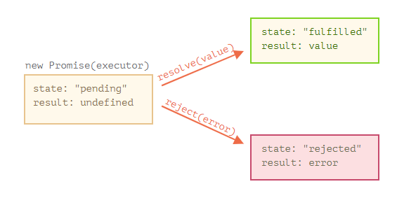

`#es6` `promises` `#assembler-school` `#master-in-software-engineering`

# Assembler School: Promises Workshop <!-- omit in toc -->

In this workshop you will learn how to work with Promises.

## Table of Contents <!-- omit in toc -->

- [Getting Started](#getting-started)
- [Workshop Material](#workshop-material)
- [Why Do We Need Promises?](#why-do-we-need-promises)
- [Problems With Using Callbacks](#problems-with-using-callbacks)
- [Working With Promises](#working-with-promises)
- [Examples](#examples)
- [`async`/`await` with Promises](#asyncawait-with-promises)
- [Author](#author)
- [License](#license)

## Getting Started

First, you will need to clone the repo:

```bash
$ git clone https://github.com/assembler-school/promises-workshop.git
```

Then, you will have to install all the dependencies with npm:

```bash
$ npm install
```

## Workshop Material

- [Slides](https://docs.google.com/presentation/d/1lbie5bQQYlFW3vwqHAbmo3fHCWeXOgsWrMy2NzV_DnU/edit?usp=sharing)

## Why Do We Need Promises?

Due to the nature of modern JavaScript applications that mostly rely on building their interfaces dynamically, we need a way to communicate with remote servers asynchronously without blocking the rendering of the browser so that the user can still use the application or browser while the information is returned from the server.

## Problems With Using Callbacks

### Callbacks Could Be Called More Than Once

If we pass a callback to another function we lose the control over how our callback might get called. Since callbacks are just functions, they might get called once, more than once, or even never...

```js
function onComplete() {
  console.log("I'm done!");
}

function onFail(error) {
  console.log(error.message);
}

function chargeBill(total) {
  // Logic for charging the bill from the user account
  console.log(`Charged $${total} from the user's account`);
}

function paymentPlatform(total, chargeBill, done, fail) {
  try {
    // The user's bill is charged 4 times
    chargeBill(total); // Charged $2000 from the user's account
    chargeBill(total); // Charged $2000 from the user's account
    chargeBill(total); // Charged $2000 from the user's account
    chargeBill(total); // Charged $2000 from the user's account

    done(); // I'm done!
  } catch (error) {
    fail(error);
  }
}

paymentPlatform(2000, chargeBill, onComplete, onFail);
```

### Our Callbacks Might Never Get Called

Our callbacks might never get called therefore we might never get notified of when the app has finished processing.

```js
function onComplete() {
  console.log("I'm done!");
}

function onFail(error) {
  console.log(error.message);
}

function chargeBill(total) {
  // Logic for charging the bill from the user account
  console.log(`Charged $${total} from the user's account`);
}

function paymentPlatform(total, chargeBill, done, fail) {
  try {
    chargeBill(total); // Charged $2000 from the user's account

    // Our done callback is never called
  } catch (error) {
    fail(error);
  }
}

paymentPlatform(2000, chargeBill, onComplete, onFail);
```

### We Might Not Get Notified Of The Errors

Callbacks might not notify us of the errors that were triggered.

```js
function onComplete() {
  console.log("I'm done!");
}

function onFail(error) {
  console.log(error.message);
}

function chargeBill(total) {
  // Logic for charging the bill from the user account
  console.log(`Charged $${total} from the user's account`);

  throw new Error("Insufficient Credit");
}

function paymentPlatform(total, chargeBill, done, fail) {
  try {
    chargeBill(total); // Charged $2000 from the user's account

    done(); // I'm done!
  } catch (error) {}
}

paymentPlatform(2000, chargeBill, onComplete, onFail);
```

### Handling Asynchronous Code Before ES6

Before we had promises in JavaScript the only way that we could execute asynchronous code was by using callbacks, setTimeout or setInterval. However, error handling and control flow of the execution of the code wasn’t very easy to handle and understand.

```js
setTimeout(function performLongOperation() {
  // performing a long operation that would block the UI...
}, 3000);

setInterval(function executeEverySecond() {
  // a function that runs every second that shouldn’t block the UI...
}, 1000);
```

### Callback Hell

Another problem of traditional JavaScript is that by using callbacks we could end up with what is commonly known as the callback hell… This happens when we need to perform a network request that is based on the previous response.

```js
// Each nested function depends on the result of the enclosing function.
// This creates a nested structure of function calls that depend on each other.
loginUser(function (user) {
  getUserDetails(user, function (userDetails) {
    getUserCart(userDetails, function (cart) {
      getCartItems(cart, function (cartItems) {
        getCartItemComments(cartItems[0], function (comments) {
          console.log(comments);
        });
      });
    });
  });
});
```

## Working With Promises

**Promises can have 3 states.**

- `pending`: this is the base state of the promise before it is resolved or rejected.
- `fulfilled`: this is the state that the promise has after it has been resolved with a value
- `rejected`: this is the state that the promise has after it has been rejected with an error

<div align='center'>
  
</div>

### Creating and Resolving Promises

To create a `Promise`, we simply call the Promise constructor and pass it two callback functions that we can execute to indicate that the `Promise` has been resolved or rejected with a value.

```js
function makePenPromise() {
  return new Promise((resolve, reject) => {
    setTimeout(() => {
      resolve("Thank you the pen!");
    }, 500);
  });
}

let penPromise = makePenPromise();
console.log(penPromise); // Promise {<pending>}

penPromise.then((result) => {
  console.log(result); // Thank you the pen, here you go

  console.log(penPromise); // Promise {<fulfilled>: "Thank you the pen!"}
});
```

### Rejecting Promises

If we want to reject a `Promise` when we encounter an error, we can use the second callback that the `Promise` receives. It is usually called reject as a convention and it is recommended to pass it as an argument an `Error` object. We will then be able to catch the exception in the `.catch()` block.

```js
function makePenPromise() {
  return new Promise((resolve, reject) => {
    setTimeout(() => {
      reject(new Error("I will keep the pen"));
    }, 500);
  });
}

let penPromise = makePenPromise();
console.log(penPromise); // Promise {<pending>}

penPromise.catch((error) => {
  console.log(error.message); // I will keep the pen!

  console.log(penPromise); // Promise {<rejected>: "I will keep the penn!"}
});
```

### Uncaught Promises Will Break The Program

It is important to catch and handle all the exceptions in our apps to avoid breaking the app when the users are trying to use it. It is also recommended to catch the exceptions and show a helpful error message in the UI so that the user can know that the app is in a state that cannot be trusted anymore due to the error that happened.

```js
function makePenPromise() {
  return new Promise((resolve, reject) => {
    setTimeout(() => {
      reject(new Error("I will keep the pen"));
    }, 500);
  });
}

let penPromise = makePenPromise();
console.log(penPromise); // Promise {<pending>}

// Uncaught (in promise) Error: I will keep the pen
penPromise.then((result) => {
  console.log(result); // Thank you the pen!
});
```

### Normal Execution Flow of a `Promise`

Usually promises are created in the following way:

1. We try to execute some logic
2. We resolve the promise with the result of the logic
3. If we catch any error we reject the promise with it

```js
function performSomeOperation() {
  return "Result...";
}

function task() {
  return new Promise((resolve, reject) => {
    try {
      const result = performSomeOperation();
      resolve(result);
    } catch (error) {
      reject(error);
    }
  });
}

task()
  .then((result) => {
    // the result
    console.log(result);
  })
  .catch((error) => {
    console.log(error.message);
  });
```

### `.finally()`

Besides the `.then()` and `.catch()` methods we can also use the `.finally()` method to execute some logic after the promise has been settled. It doesn’t matter if the `Promise` was `rejected` or `resolved`, the `.finally()` method will always be executed as the last step.

```js
function fetchGalleryData() {
  return new Promise((res) => res("Some images"));
}

function showSpinner() {
  console.log("Data loading...");
}

function hideSpinner() {
  console.log("The data has been loaded!");
}

function updateGallery(data) {
  console.log(`Gallery updated with: ${data}`);
}

function showNoDataError(error) {
  console.error(error.message);
}

showSpinner();

fetchGalleryData()
  .then((data) => updateGallery(data))
  .catch(showNoDataError)
  // .finally() is always executed
  .finally(hideSpinner);
```

### Chaining `.then()` Calls

`.then()` always returns a `Promise`, which enables you to chain method calls one after the other. This way we can avoid entering a callback hell of Promises simply because we can take advantage of `Promise` chaining.

```js
function asyncFunc1() {
  return new Promise((res) => res("hello"));
}

function asyncFunc2(result) {
  return new Promise((res) => res(`${result}-world`));
}

asyncFunc1()
  .then((result1) => {
    // Use result1
    return asyncFunc2(result1); // (A)
  })
  .then((result2) => {
    // (B)
    console.log(result2);
  })
  .catch((error) => {
    // Handle errors, if any, of asyncFunc1() and asyncFunc2()
    console.log(error.message);
  });
```

### Chaining

As the `Promise.then()` and `Promise.catch()` methods return promises, they can be chained.

<div align='center'>
  
</div>

## Examples

### Creating a Promise That Expires

```js
function promiseWithTimeout() {
  return new Promise((resolve, reject) => {
    setTimeout(() => {
      // It will reject the promise after 3 seconds
      // Then, even if performNetworkCall() finishes
      // the promise has already been setled
      // and it will ignore the resolve(value) call
      reject(new Error("The network call is too slow!"));
    }, 3000);

    // It takes 5 seconds to complete the network call
    performNetworkCall().then((result) => {
      resolve(result);
    });
  });
}

function performNetworkCall() {
  return new Promise((resolve) => {
    setTimeout(() => {
      resolve("Too late...");
    }, 5000);
  });
}

promiseWithTimeout()
  .then((result) => {
    // Never called
    console.log(result);
  })
  .catch((error) => {
    // The network call is too slow!
    console.log(error.message);
  });
```

### Callback Hell With Promises

If we take the example from before of a callback hell:

```js
// Each nested function depends on the result of the enclosing function.
// This creates a nested structure of function calls that depend on each other.
loginUser(function (user) {
  getUserDetails(user, function (userDetails) {
    getUserCart(userDetails, function (cart) {
      getCartItems(cart, function (cartItems) {
        getCartItemComments(cartItems[0], function (comments) {
          console.log(comments);
        });
      });
    });
  });
});
```

The previous code could be refactored to use promises which allows us to avoid having a callback hell, to have more readable code and to be able better handle errors.

```js
loginUser()
  .then((user) => {
    // If the getUserDetails function returns a Promise
    // we should return it rather than adding a .then() call
    return getUserDetails(user);
  })
  .then((userDetails) => getUserCart(userDetails))
  .then((cart) => getCartItems(cart))
  .then((cartItems) => getCartItemComments(cartItems[0]))
  .then((comments) => console.log(comments))
  .catch((error) => console.error(error));
```

### Promise Callback Hell Gotcha

```js
loginUser()
  .then((user) => {
    // ⚠️ Doesn’t return the promise
    getUserDetails(user).then((userDetails) => {
      // ⚠️ Doesn’t return the promise
      getUserCart(userDetails).then((cart) => {
        getCartItems(cart)
          .then((cartItems) => {
            // ✅ Returns the promise created
            return getCartItemComments(cartItems[0]);
          })
          // ✅ Now we can continue the .then() chain
          .then((comments) => console.log(comments));
      });
    });
  })
  .catch((error) => console.error(error));
```

### `Promise.resolve(value)`

Returns a resolved promise with the value received.

```js
Promise.resolve("abc").then((x) => console.log(x)); // abc
```

### `Promise.reject(error)`

Returns a `Promise` that is rejected with the error received.

```js
Promise.reject(new Error("Problem!")).catch((err) => {
  console.log(err.message); // Problem!
});
```

### `Promise.all()`

`Promise.all()` enables you to be notified once all results are in. Its input is an Array of Promises, its output a single `Promise` that is fulfilled with an Array of the results.

```js
import axios from "axios";

function getUser(userId) {
  return axios.get(`https://jsonplaceholder.typicode.com/users/${userId}`);
}

Promise.all([getUser(1), getUser(2), getUser(3), getUser(4)])
  // receives an array with the responses
  // of each Promise
  .then(([user1, user2, user3, user4]) => {
    // {id: 1, name: "Leanne Graham" …}
    console.log(user1.data);
    // {id: 2, name: "Ervin Howell" …}
    console.log(user2.data);
    // {id: 3, name: "Clementine Bauch" …}
    console.log(user3.data);
    // {id: 4, name: "Patricia Lebsack" …}
    console.log(user4.data);
  })
  .catch((error) => {
    // Fails the entire Promise
    // on the first rejection among the Promises
    console.log(error.message);
  });
```

### `Promise.race()`

The `Promise.race()` method returns a promise that fulfills or rejects as soon as one of the promises in an iterable fulfills or rejects, with the value or reason from that promise.

```js
const promise1 = new Promise((resolve, _reject) => {
  setTimeout(() => {
    resolve("one");
  }, 500);
});

const promise2 = new Promise((resolve, _reject) => {
  setTimeout(() => {
    resolve("two");
  }, 100);
});

Promise.race([promise1, promise2]).then((value) => {
  console.log(value); // two
  // Both resolve, but promise2 is faster
});
```

## `async`/`await` with Promises

### `async` Functions

`async` functions are a new feature of the language that allows us to work with promises in an easier way. The value returned by the `async` function will be wrapped in a resolved Promise.

```js
// basic syntax of an `async` function
async function getUsers() {
  return [];
}

// same as
function getUsers() {
  return Promise.resolve([]);
}
```

### `await` Keyword

The `await` keyword can only be used inside `async` functions and it allows us to pause the execution of the function until the value we are awaiting is resolved or rejected.

```js
async function getUsers() {
  const response = await fetch("https://jsonplaceholder.typicode.com/users/");

  const users = await response.json();

  console.log(users); // [{...}, {...}, {...}]
}
```

### `await`

The `await` keyword will wait until the promise is either rejected or resolved and it will either return the resolved value or it will throw the rejected error.

```js
async function myFunction() {
  let promise = new Promise((resolve, _reject) => {
    setTimeout(() => resolve("done!"), 2000);
  });

  console.log("Before await"); // => Before await

  // wait until the promise resolves (*)
  let result = await promise;

  console.log("After await"); // => After await

  console.log(result); // => done!
}
```

### You Cannot Use the `await` Keyword Outside an `async` Function

It is **important** to remember that we can only use the await keyword inside async functions, otherwise the language will throw an error.

```js
// not an async function!!
function getUsers() {
   // ERROR: Can not use keyword 'await' outside an async function
   const response = await fetch("https://jsonplaceholder.typicode.com/users/");
   const users = await response.json();
   console.log(users); // [{...}, {...}, {...}]
}
```

### `async`/`await` Error Handling

The best way to handle errors with `async`/`await` functions is to wrap the code in a `try`/`catch` block.

```js
function task() {
  return new Promise((resolve, reject) => {
    setTimeout(() => {
      reject(new Error("Ups"));
    }, 1000);
  });
}

async function waitForTask() {
  let result = "";

  try {
    result = await task();
  } catch (error) {
    result = error.message;
  }

  console.log(result); // Ups
}
```

## Author

[Dani Lucaci](https://github.com/danilucaci)

## License

[MIT](https://choosealicense.com/licenses/mit/)
